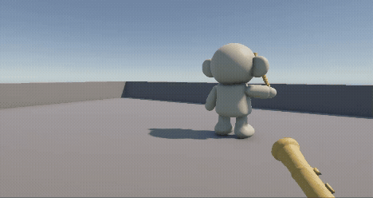
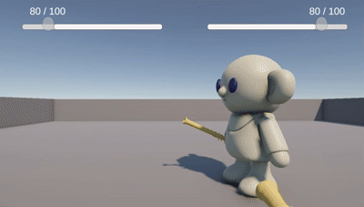
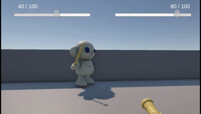
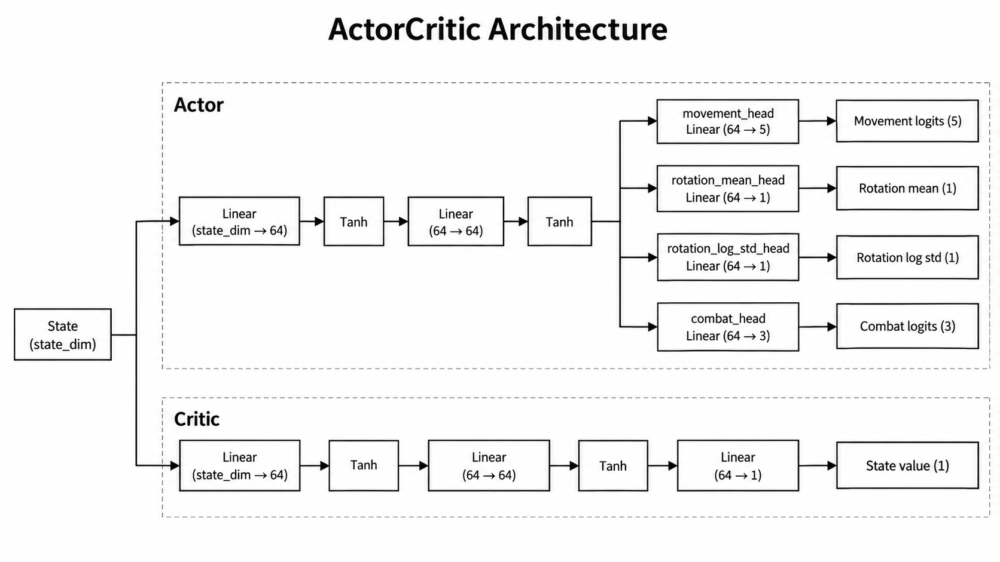

# Unity game agent with PPO


This project connects a simple Unity based combat environment to a custom PyTorch implementation of **PPO**. Agents learn movement, rotation, and combat actions from gameplay observations and rewards.

<!-- Add a gameplay screenshot at assets/images/game-overview.png to enable this preview.
<p align="center">
  
</p>
-->

## Example Video

| 0 Episodes | 100 Episodes | 500 Episodes |
|:---:|:---:|:---:|
|  |  |  |

**0 Episodes:** Completely random actions with no learned strategy.

**100 Episodes:** Roughly tracks the opponent but attacks indiscriminately.

**500 Episodes:** Engages at close range with a higher parry success rate.


## System Overview

```text
                        Unity
      ┌────────────────────────────────────────┐
      │ EnemyState · Combat · Health · Movement │
      │     Observations, rewards, gameplay     │
      └───────────────────┬────────────────────┘
                          │ State / Reward / Done
                          │ TCP + JSON
                          ▼
      ┌────────────────────────────────────────┐
      │                 Python                 │
      │ state_preprocessor.py → 31-D state     │
      │          Actor–Critic / PPO            │
      └───────────────────┬────────────────────┘
                          │ Movement / Rotation / Combat
                          ▼
                    Unity executes action
                          │
                  Episode ends (done=True)
                          ▼
               PPO update → save checkpoint
                          │
                    episode_end acknowledgment
                          ▼
                       Next episode
```

Unity handles character movement, attack and parry mechanics, health, and episode termination. Python handles state preprocessing, policy inference, rollout collection, and PPO updates.

## Model Architecture



The policy uses a shared representation with separate heads for the three action types, while the critic estimates state value.

| Component | Output | Distribution / role |
| :-- | :-- | :-- |
| Observation | 31-dimensional vector | `state_preprocessor.py` |
| Movement head | 5 discrete actions | Categorical |
| Rotation head | 1 continuous action | Normal distribution followed by `tanh`; scaled to ±30° for Unity |
| Combat head | 3 discrete actions | Idle / Attack / Parry (Categorical) |
| Critic | 1 state value | PPO value estimation |

## Observation and Action Space

The state sent from Unity to Python has the following format:
```json
{
  "type": "state",
  "enemyRelativePosition": { "x": 1.2, "y": 0.0, "z": -3.4 },
  "distance": 2.4,
  "angleToEnemy": 35.0,
  "myHealth": 1.0,
  "enemyHealth": 0.8,
  "myAction": 0,
  "enemyAction": 1,
  "myPreviousMovement": 1,
  "myPreviousRotation": 5.0,
  "myPreviousCombat": 0,
  "enemyPreviousMovement": 2,
  "enemyPreviousRotation": -3.0,
  "enemyPreviousCombat": 1
}
```

The action sent from Python to Unity has the following format:
```json

{
  "type": "action",
  "movement": 1,
  "rotation": 5.0,
  "combat": 0
}
```

Movement uses values `0–4`, combat uses `0–2`, and rotation is transmitted in degrees.

## Reward Design

The reward function combines combat outcomes with orientation and distance-based shaping.

| Event | Default reward |
| :-- | --: |
| Successful attack | +2.00 |
| Missed attack | −0.20 |
| Successful parry | +2.00 |
| Taking damage | −1.00 |
| Defeating the opponent | +10.00 |
| Agent death | −10.00 |
| Facing away from the opponent | −0.01 / sample |
| Approaching outside the preferred combat distance | +0.02 / sample |
| Retreating outside the preferred combat distance | −0.03 / sample |


